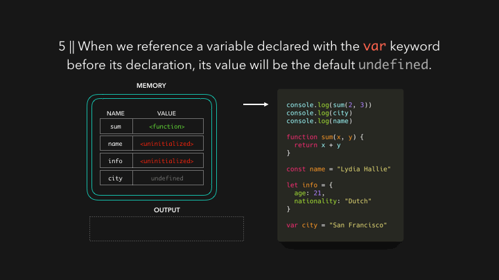

# 🔥🕺🏼 자바스크립트 시각화: 호이스팅 Hoisting

호이스팅은 모든 자바스크립트 개발자가 들어본 적 있는 용어 중 하나 일 것입니다. 여러분의 에러를 구글링하다가 스택오버플로우에 이르게 되면 그곳에 개발자들은 호이스팅이 원인이라고 말하는 것을 봤을 수도 있습니다. 그러면 **호이스팅**이 무엇일까요? (참고로 `스코프, scope`는 다른 글에서 다룰 것입니다. 짧고 집중적이게 다루는 것이 목적이기 때문에..)

만약 여러분이 자바스크립트를 처음 배운다면, 여러분은 아마 몇 가지 변수가 무작위로 `undefined` 혹은 `ReferenceErrors` 등을 가지게 되는 이상한 현상을 경험을 했을 수 있습니다. 주로 호이스팅은 파일 맨 위에 변수 그리고 함수 넣는 것이라고 설명되지만 그렇게 작동하는 것이 아닙니다. 비록 그렇게 보일지라도...

우리가 쓴 스크립트 코드를 자바스크립트 엔진이 해석할 때, 제일 먼저 하는 것은, 우리 코드의 데이터를 위해 메모리를 설정하는 것입니다. 이 단계에서는 실행중인 코드가 없고 실행을 위한 모든 준비를 하는 데, 이때 함수 선언과 변수를 저장하는 방법이 다릅니다. 함수는 함수 전체에 대한 참조와 함께 저장됩니다.

변수는 살짝 다릅니다. ES6 변수를 선언하는 두 가지의 새로운 키워드를 소개하는 데, 바로 `let`과 `const` 입니다. `let` 또는 `const` 키워드로 선언된 변수는 `uninitialized`로 저장됩니다.

`var` 키워드로 선언된 변수는 `undefined` 라는 디폴트 값으로 초기화 되어 메모리에 저장됩니다.

생성 단계는 끝이 났습니다. 우리는 이제 실제로 코드를 실행할 수 있는 겁니다. 함수 또는 아무런 변수를 선언해주고 파일의 맨 위의 3개의 `console.log`로 무슨 일이 일어나는 지 봐봅시다.

선언한 함수 전체를 참조하여 함수가 저장되기 때문에, 우리는 그 함수가 생성되기도 전에 호출할 수 있습니다!

`var` 키워드로 선언될 변수를 선언 전에 참조할 때, `undefined`로 저장된 디폴트 값을 반환한다. 하지만 이는 “예상치 못한” 상황으로 이어질 수 있습니다. 대부분의 경우, 의도치 않게 참조하고 있다는 것을 의미합니다. (아마 실제론 `undefined`를 원하지 않을 것입니다)

`var` 키워드를 사용했을 때 같이, 실수로 `undefined` 변수를 참조하는 것을 방지하기 위해, 우리가 초기화 되지 않은 변수를 참조하였을 때, `ReferenceError`를 발생 시켜줍니다. 실제 선언 이전의 “구역”을 시간적 소멸 구역(Temporal dead zone)이라고 부르는 데, 이 구역에서는 변수를 초기화 전에 참조할 수 없습니다. (ES6 class도 포함!!)

엔진이 우리가 실제로 변수를 선언한 라인을 지나갈 때, 해당 변수에 우리가 선언한 값으로 메모리에 덮어 쓰여집니다.

(7번째 사진인데 잘못 나왔네요. 최대한 빨리 수정할게요...ㅎㅎ)

---

끝났습니다! 빠르게 복습해보겠습니다.

코드가 실행되기 전에 실행 컨텍스트를 위해 함수와 변수는 메모리에 저장된다. 이것을 **호이스팅**이라고 부른다.
함수는 함수 전체가 참조되어 저장이 되고, `var`로 선언된 변수는 `undefined`로, `let` 또는 `const`로 선언된 변수는 `uninitialized`로 저장된다.

우린 코드가 실행되었을 때, 어떤 일이 발생하는지 봤기 때문에, 이제 호이스팅이라는 용어가 여러분에게 덜 애매했으면 좋겠네요.

