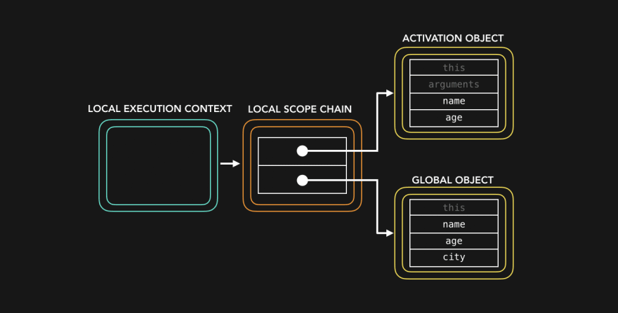
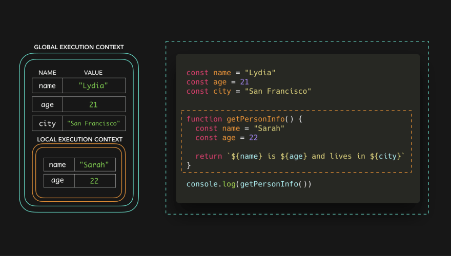
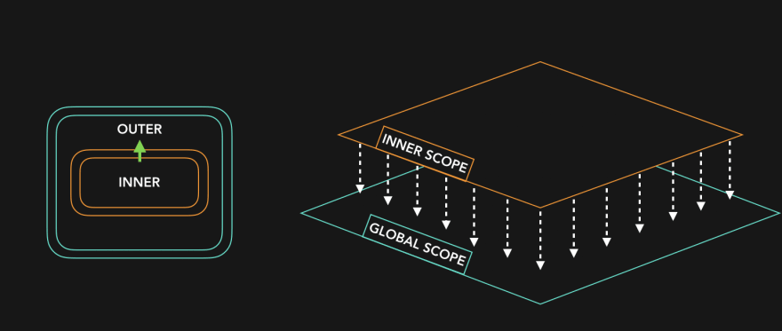
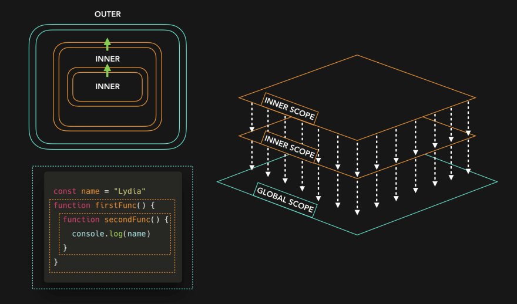

# ⚡️⛓ 자바스크립트 시각화: 스코프 (체이닝), Scope (Chain)

> 읽는 것에 오류를 줄이기 위해 Execution Context는 해석하지 않겠습니다

이번 글에서는 스코프 체인에 대해 이야기 하려고 합니다.🕺🏼 이 글을 읽기 전에 실행 컨텍스트(Execution Contexts)에 대한 개념을 숙지해주세요.😃

아래의 코드를 봐주세요.

```javascript
const name = "Lydia";
const age = 21;
const city = "San Francisco";


function getPersonInfo() {
  const name = "Sarah";
  const age = 22;

  return `${name} is ${age} and lives in ${city}`;
}

console.log(getPersonInfo())
```

`name`, `age` 그리고 `city` 라는 변수를 포함한 문자열을 반환하는 `getPersonInfo`라는 함수를 호출하면 `Sarah is 22 and lives in San Francisco`가 반환됩니다. 하지만 `getPersonInfo`함수는 `city`라는 이름의 변수를 가지고 있지 않습니다. 어떻게 `city`의 값을 알 수 있었을 까요 🤨?

먼저, 메모리 영역에는 다른 Context로 설정되는데, **Global Context(브라우저의 `window`객체,  Node.js의 `global`객체)**와 `getPersonInfo`함수가 호출되는 **Local Context**로 이루어지게 됩니다. 또한 각각의 Context는 **스코프 체인**을 가지게 됩니다.

`getPersonInfo`함수의 경우, 스코프체인은 다음과 같이 보입니다. (아직 이해가 안될 수 있습니다)



스코프 체인은 기본적으로 해당 Execution Context에서 접근 가능한 **값(또는 다른 스코프)**에 대한 참조가 포함된 객체를 가지는 **“참조 체인(chain of references)”**입니다. (⛓: 해당 Context 안에서 참조할 수 있는 값은 이게 다 입니다) 또한 Execution Conext가 생성될 때, 스코프 체인은 생성됩니다. 그 말은 즉슨, 스코프체인은 런타임(RunTime)에서 생성된다는 것을 의미합니다.

하지만, 이 글에서는 `activation object` 또는 Execution Context에 대해 설명하진 않을 것이고 스코프에 관해서만 집중적으로 다뤄볼 것입니다. 아래에 예제를 보면, Execution Context에서 키/값 쌍은 해당 스코프 체인이 가지는 변수에 대한 참조를 나타냅니다.


Global Execution Context의 스코프 체인은 (`name`, `Lydia`), (`age`, `21`), (`city`, `San Francisco`) 이렇게 3개의 변수에 대한 참조를 가지고 있고, Local Context는 (`name`, `Sarah`), (`age`, `22`)로 2개의 변수에 대한 참조를 가지고 있습니다.

`getPersonInfo`함수에서 변수에 대한 접근을 시도할 때, JS 엔진은 로컬 스코프 체인을 먼저 확인합니다.



로컬 스코프 체인은 `name`과 `age`에 대한 참조를 가지고 있는데, `name`은 `Sarah`라는 값을 가지고 있고 `age`는 `22`이라는 값을 가지고 있습니다. 하지만 이제 `city`를 참조하려 할 때, 어떤 일이 일어날까요?

JS 엔진은 `city`의 값을 찾기 위해서 하위 스코프 체인 내려 가는데, 이를 통해 로컬 스코프가 참조하고 있는 외부 스코프(이 경우엔 **global object**)에서 변수 `city`의 값을 찾을 수 있는지 확인할 수 있습니다.


Global Context에서, 우리는 `San Francisco`라는 값을 가진 `city` 변수를 선언하였었고, 따라서 함수에 명시된 `city`변수의 값으로 가질 수 있습니다. 이제 이 변수의 값을 얻었기 때문에, `getPersonInfo`함수는 문자열 `Sarah is 22 and lives in San Francisco `를 반환 할 수 있습니다. 🎉

---

스코프 체인은 하위 스코프 체인으로 갈 수 있지만 상위 스코프 체인(“외부 스코프” 라고도 합니다)으로 갈 수 없습니다. 일종의 폭포 처럼 예시를 들어보겠습니다.



더욱 스코프가 깊을 때,



---

이 코드를 예로 들어보겠습니다.


이전의 코드와 거의 비슷하지만 한 가지 다른 점이 있습니다. 바로 `city`변수를 글로벌 스코프가 아닌 `getPersonInfo`함수 내부에만 선언하였습니다. 코드상 아직 `getPersonInfo`함수를 호출하지 않았고 Local Context도 생성되지 않았습니다. 그러나, 코드에서는 `name`, `age`, `city`를 Global Context에서 접근하려고 합니다.


글로벌 스코프에서 `city`라는 변수의 참조를 찾을 수 없고, 외부 스코프에서도 찾을 수 없고, 내부 스코프는 참조할 수 없기 때문에 `ReferenceError`가 발생합니다!

이렇게 하면, 스코프를 이용하여 변수를 “보호”하고 변수의 이름을 재사용할 수 있습니다.

---

또한 글로벌 스코프 그리고 로컬 스코프 외에, **블록 스코프**가 있는 데, `let` 또는 `const` 키워드로 선언된 변수는 가장 가까운 중괄호({ })를 스코프로 가집니다.

```javascript
const age = 21

function checkAge() {
  if (age < 21) {
    const message = "You cannot drink!"
    return message
  } else {
    const message = "You can drink!"
    return message
  }
} 
```

스코프를 선으로 표현하자면 아래 그림과 같이 생겼습니다.


여기에는 글로벌 스코프, 함수 스코프, 그리고 두 개의 블록 스코프가 있고, 중괄호로 스코프가 나눠져 있기 때문에, `message`변수를 두 번 선언할 수 있습니다. 

---

> 정리하자면
> - 스코프 체인은 현재 컨텍스트(Context)에서 접근할 수 있는 값에 참조를 할 수 있도록 해주는 체인이라고 할 수 있다.
> - 스코프는 자신의 내부 스코프(Inner Scope)를 참조할 수 없지만 외부 스코프(Outter Scope)는 참조할 수 있고, 하위 스코프 체인(Outter)에 정의된 변수의 이름을 재사용할 수 있도록 해준다.

