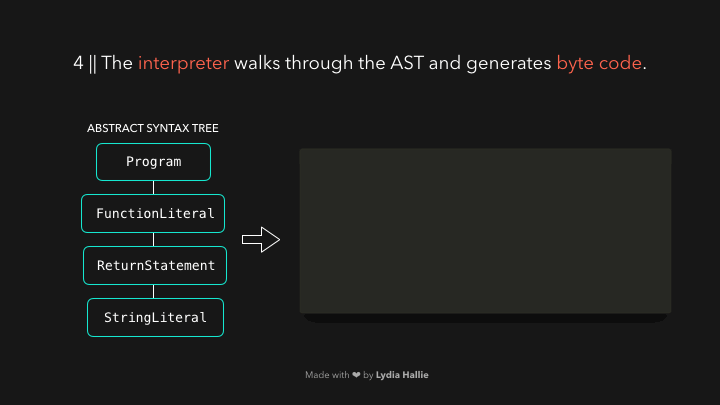

# 🚀⚙️ 자바스크립트 시각화 : JavaScript 엔진

자바스크립트는 좋지만, 실제로 어떻게 작동하는지 이해하고 코드를 작성하고 있나요? 자바스크립트 개발자라고 해서, 컴파일러를 직접 다룰 필요가 없지만 자바스크립트 엔진의 기본과 개발자 친화적인 JS 코드가 어떻게 핸들링 되는지 아는 것은 분명히 도움이 될 것입니다.

> Note: 이 글은 Node.js와 크로미움(Chromium)을 기반으로 하는 브라우저가 사용하는 V8 엔진의 내용을 담고 있습니다.

---

HTML 파서가 `src` 속성과 같이 있는 `script`태그를 맞닥뜨리면, 네트워크, 캐시, 또는 설치된 서비스 워커 중에서 `src`경로에 있는 소스코드를 불러오고, 이때 요청된 스크립트는 Byte Steam Decoder가 처리할 수 있는 Byte Steam으로 응답됩니다. 그러면 이제 Byte Steam Decoder가 다운로드된 steam을 디코딩합니다.


---

Byte Steam Decoder는 디코드된 byte steam으로 **토큰**을 만듭니다. 예를 들어 `0066` -> `f`, `0075` -> `u`, `006e` -> `n`, `0063` -> `c`, `0074` -> `t`, `0069` -> `i`, `006f` -> `o`, `006e` ->`n`으로 디코딩되고 (단락을 분별하기위해 뒤에 공백이 추가되어 있다) 이렇게 우리가 작성한 `function`이 됩니다. `function`은 JS의 예약어이므로 토큰으로 생성되고 (gif엔 없는) pre-parser와 parser로 보내집니다. 나머지 steam도 마찬가지로 작동합니다.


---

엔진은 **pre-parser**와 **parser**라는 2개의 파서를 사용는 데, 웹 페이지에 로딩되는 시간을 줄이기 위해, 엔진은 불필요한 코드는 즉시 파싱하지 않으려고 합니다. **pre-parser**는 나중에 사용할지도 모르는 코드를 처리하고 **parser**는 즉시 필요한 코드를 처리합니다.
만약 사용자가 버튼을 클릭하였을 때만 호출되는 함수가 있다면, 이 함수는 웹페이지를 로드하기 위해 필요하지 않으므로 즉시 컴파일할 필요는 없습니다. 사용자가 버튼을 클릭한다면 해당 부분의 코드를 필요로 하여, **parser**로 보내지게 됩니다.

파서(parser)는 Byte Steam Decoder로부터 온 토큰을 기반 으로 노드(node)를 만들고, 이 노드로 Abstract Syntax Tree (추상 구문 트리, AST)를 만듭니다. 🌳


---

이제 **인터프리터(interpreter ignition)를** 사용합니다. 인터프리터는 AST를 읽고 이를 기반으로 **바이트 코드**를 생성합니다. 바이트 코드가 생성되면, AST는 삭제됨과 동시에 메모리 공간에서 지워집니다. 우린 이제 **바이트코드**를 통해 엔진 이용한 작업을 할 수 있게 됩니다! 🎉



---

바이트코드는 빠르지만, 더욱 빠르게 할 수도 있습니다. 바이트 코드가 실행되면서 `정보`가 생성되는데, 특정 행동(event, function)이 자주 발생했는지, 사용했었던 데이터 타입인지를 감지할 수 있습니다. 아마 우리는 수없이 많이 함수를 호출했을 겁니다. 이를 통해 생성된 `정보`를 통해, 우리는 더욱 빠르게 실행 위한 최적화할 수 있습니다.🏃🏽

Byte Code는, 생성된 type feedback과 함께 **최적화 컴파일러(optimizing compiler - TurboFan)로** 보내집니다. 최적화 컴파일러는 이 2가지를 이용하여, 매우 최적화된 기계어를 만들어냅니다.🚀


---

자바스크립트는 동적 타입 언어입니다. 데이터의 타입 계속해서 바뀔 수 있다는 것을 의미합니다. 만약 어떤 값이 가지는 데이터 타입을 자바스크립트 엔진이 매번 검사한다면 굉장히 느릴 것입니다.

코드를 해석(Interpret)하는 시간을 줄이기 위해서, 최적화된 기계어(machine code)에서는 바이트코드가 실행되는 동안 엔진이 본 적 있는 케이스만 처리하고, 만약 우리가 반복해서 같은 타입을 반환하는 어떤 코드를 사용한다면, 최적화된 기계어에서는 속도를 높이기 위해 이전 코드를 재사용할 것입니다. 그러나, JS는 동적인 타입을 가지기 때문에, 같은 코드라 하여도 갑자기 다른 타입의 데이터를 반환할 수 있습니다. 그렇게 되면, 기계어는 최적화되지 않고, 엔진은 생성된 바이트코드를 다시 해석(interpreting)하게 됩니다.

어떤 함수가 100번 호출되었고, 항상 같은 값을 반환한다고 가정하였을 때, 101째 호출되었을 때도 같은 값일 것이라고 예상할 수 있습니다.

아래의 “sum”함수를 보면, “sum”함수를 호출하면서 항상 숫자 값을 매개변수로 넘겨주고 있습니다.

```javascript
function sum(a, b) {
  return a + b;
}

sum(1, 2);
```

숫자 `3`이 반환됩니다! 다음에 함수를 호출할 때, 2개의 숫자 값과 함께 호출할 것이라고 예상할 수 있을 것입니다.

만약 이 예상이 맞다면, 동적 탐색(dynamic lookup)은 필요하지 않을 것이고 최적화된 기계어를 재사용하면 될 것입니다. 틀렸다면, 최적화된 기계어 대신 원래의 바이트코드로 되돌아가야 합니다.

> 여기서 동적 탐색(dynamic lookup)이란, 데이터의 저장, 삭제가 런타임 상에서 동적으로 일어날 수 있는 경우에 사용하는 데이터 접근 방식이다. 데이터 프로퍼티에 접근할 때 마다, 해당 프로퍼티의 메모리상의 위치를 찾아야 한다.

예를 들어, 다음에 호출할 때, 숫자 대신 문자열을 넘겨줄 수 있습니다. (자바스크립트는 동적 타입을 가지기 때문에, 에러를 일으키지 않습니다!)

```javascript
function sum(a, b) {
  return a + b;
}

sum('1', 2);
```

숫자 2가 강제로 문자열이 되고, “12”라는 문자열을 반환합니다. 엔진은 번역(interpret)된 바이트코드를 실행하는 부분으로 돌아가고, Type feedback가 수정되며, 이후에 최적화 작업을 거치게 됩니다.

---

전체적인 프로세스는 아래의 사진을 참고해주세요.


#### 마치며
이 글이 도움 됬기를 바랍니다. 물론 엔진의 모든 부분을 이 글에 담진 않았지만 (JS heap, call stack, 등.) 추후 시리즈에서 이야기해보도록 하겠습니다. 자바스크립트의 내부 구조에 대해 관심이 생겼다면, 직접 검색하여 찾아보기를 추천합니다. V8엔진은 오픈소스 이고 문서에서 어떻게 내부적으로 작동하는지 자세히 설명하고 있습니다.

- [V8 Docs](https://v8.dev/)
- [V8 Github](https://github.com/v8/v8)
- [Chrome University 2018: Life Of A Script](https://www.youtube.com/watch?v=voDhHPNMEzg&t=729s%3Cbr%3E%0A)
- [V8 엔진 컨퍼러스 영상](https://www.youtube.com/watch?time_continue=1513&v=p-iiEDtpy6I&feature=emb_title)
- [V8 Hidden Class - 번역본](https://engineering.linecorp.com/ko/blog/v8-hidden-class/)

> 본 시리즈은 [DEV](https://dev.to/) 에 올라온 [Lydia Hallie](https://github.com/lydiahallie)의 **JavaScript Visualized 시리즈**를 번역한 것입니다.
>
> - 번역에 오류가 있다면 [Pull Request](https://github.com/wlsdud2194/JavaScript-Visualized-Series/pulls)를 올려주세요.
> - origial author link : [Lydia Hallie의 dev.to](https://dev.to/lydiahallie)
